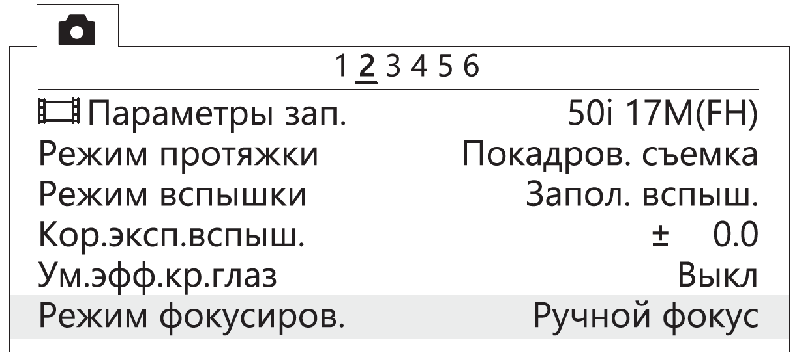

Настройка фотокамеры
=========================

.. |icon_cam| image:: _static/_images/icon_cam.png
    :width: 25

.. |icon_set| image:: _static/_images/icon_set.png
    :width: 25

.. |icon_bag| image:: _static/_images/icon_bag.png
    :width: 25

.. |icon_sd| image:: _static/_images/icon_sd.png
    :width: 25

.. |icon_key| image:: _static/_images/icon_key.png
    :width: 25

В разделе представлены рекомендуемые производителем настройки для фотокамер комплексов Геоскан.

Тип установленной на борту БВС фотокамеры зависит от комплектации комплекса.

Настройка фотокамеры Sony A6000
------------------------------------

Перед настройкой ознакомьтесь `инструкцией по эксплуатации фотокамеры Sony A6000 <https://www.sony.ru/electronics/support/res/manuals/4532/45320554M.pdf>`_ , в которой описано назначение и использование органов управления.

Диск режимов установите в положение **S** (Приоритет выдержки).
С помощью диска управления установите следующие параметры:

.. csv-table:: 
   :align: center
   
   "**выдержка**", "**1/1000**"
   "**ISO**", "**Auto**"

* В меню фотосъемки |icon_cam| (вкладка 2) установите **Режим фокусировки** — **Ручной фокус**.

   Установка ручного фокуса для режима фокусировки

* В меню пользовательских установок |icon_set| (вкладка 1) отключите **Автоматический просмотр**.

   Отключение автоматического просмотра

* В меню пользовательских установок |icon_set| (вкладка 3) включите **Спуск без объектива**.

.. figure:: _static/_images/menu6.png
   :align: center
   :width: 300

   Включение спуска без объектива

* В меню пользовательских установок (вкладка 6) установите для кнопки **MOVIE** — **Только режим видео**.

.. figure:: _static/_images/menu7.png
   :align: center
   :width: 300

   Установка значения «Только режим видео»

* В меню настроек |icon_bag| (вкладка 2) установите **Время начала энергосбережения** - **30 мин**.

.. figure:: _static/_images/menu8.png
   :align: center
   :width: 300

   Установка времени начала энергосбережения

* В меню настроек |icon_bag| (вкладка 5) установите **Номер файла** - **Сброс**.

.. figure:: _static/_images/menu9.png
   :align: center
   :width: 300

   Сброс номера файла

**Форматиравание карты памяти**

1) Последовательно выберите **MENU →** |icon_bag| **[Настройка]** **→ Форматировать**

.. attention::  Все данные на карте памяти будут удалены!

Настройка фотокамеры Sony A6000 NIR
-------------------------------------

В меню фотосъемки установите следующие параметры:

* **Качество** - **RAW** в меню фотосъемки |icon_cam| (Вкладка 1);

.. figure:: _static/_images/menu10.png
   :align: center
   :width: 300

   Установка качества

* **ISO** не более 400 (для настройки нажать колесико управления вправо);

* **Коррекция экспозиции** от EV +1 до EV +2 (для настройки нажать колесико управления вниз).

Настройка камеры Sony DSC-RX1RM2
------------------------------------------

Перед выполнением настроек ознакомьтесь с `инструкцией по эксплуатации фотокамеры Sony RX1RM2 <https://www.sony.com/electronics/support/res/manuals/4579/45798683M.pdf>`_, в которой описано назначение и использование органов управления.

* Диск режимов установите в положение **S** (Приоритет выдержки).
* С помощью диска управления установите выдержку **1/1000**.
* Диск коррекции экспозиции установите в положение **0** (ноль).
* Кольцо переключения макро установите в положение **0,3m-∞**.
* Диск режима фокусировки установите в положение **MF**.

Для настройки нужно нажать на кнопку **MENU**, затем, в соответствии с пунктами ниже, установить требуемые значения.

* В меню пользовательских настроек |icon_set| отключите **Автоматический просмотр** (вкладка 2) и **Кнопка MOVIE** — **Только режим видео** (вкладка 6).

   Отключение автоматического просмотра

   Установка значения «Только режим видео» для кнопки MOVIE

* В меню настроек |icon_bag| установите **Время начала энергосбережения** — **30 мин** (вкладка 2) и **Номер файла** — **Сброс** (вкладка 5).

   Установка времени начала энергосбережения

   Сброс номера файла

Другие настройки камеры изменять не требуется.

**Форматирование карты памяти**

* В меню пользовательских настроек |icon_bag| (вкладка 5) выберите **Форматировать**.

   Команда «Форматировать»

.. attention::  Все данные на карте памяти будут удалены!

**Сброс настроек**

Для установки заводских настроек в меню |icon_bag| (вкладка 6) выберите **Заводск. настройка**

   Команда «Заводск. настройка»

.. attention::  Не извлекайте батарейный блок во время сброса или преустановки значений настроек!

2) После сброса установите время и дату. Если пропустить это действие, настройки фотокамеры сохраняться не будут.
3) Выключите камеру с помощью переключателя ON/OFF. 
4) Не отключайте фотокамеру от сети или АКБ в течение 3-х минут для сохранения настроек во внутреннюю память.

.. important:: Фотокамера может выводить сообщение **E:61:00**. Это означает, что он сфокусирован на максимальную дальность. На работоспособность не влияет.

Настройка камеры Sony DSC-RX1
------------------------------------------

Перед выполнением настроек ознакомьтесь с `инструкцией по эксплуатации фотокамеры <https://www.sony.ru/electronics/support/res/manuals/4469/44695786M.pdf>`_, в которой описано назначение и использование органов управления.

* Диск режимов установите в положение **S** (Приоритет выдержки).
* С помощью диска управления установите выдержку **1/1000**.
* Диск коррекции экспозиции установите в положение **0** (ноль).
* Кольцо переключения макро установите в положение **0,3m-∞**.
* Диск режима фокусировки установите в положение **MF**.

Для настройки нужно нажать на кнопку **MENU**, затем, в соответствии с пунктами ниже, установить требуемые значения.

* В меню пользовательских настроек |icon_set| (вкладка 1) отключите **Автоматический просмотр**.

.. figure:: _static/_images/RX1_menu2.png
   :width: 400
   :align: center

   Отключение автоматического просмотра

* Установки для кнопки **MOVIE** — **Только режим видео** (вкладка 3).

.. figure:: _static/_images/menu11.png
   :width: 400
   :align: center

   Установка значения «Только режим видео»

* В меню настроек |icon_key| (вкладка 2) установите **Время начала энергосбережения** — **30 мин**.

.. figure:: _static/_images/menu1.png
   :width: 400
   :align: center

   Установка времени начала энергосбережения

* В меню карты памяти |icon_sd| установите **Номер файла** — **Сброс**.

.. figure:: _static/_images/menu3.png
   :width: 400
   :align: center

   Сброс номера файла

Другие настройки камеры изменять не требуется.

**Форматирование карты памяти**

1) Последовательно выберите **MENU →** |icon_sd| **[Карта памяти]** **→ Форматировать**

.. attention::  Все данные на карте памяти будут удалены!

**Сброс настроек**

Для сброса всех настроек:

1) Последовательно выберите **MENU →** |icon_key| **[Настройки] → Инициализировать  → Сброс настроек**

.. attention::  Не извлекайте батарейный блок во время сброса или преустановки значений настроек!

2) После сброса установите время и дату. Если пропустить это действие, настройки фотокамеры сохраняться не будут.
3) Выключите камеру с помощью переключателя ON/OFF. 
4) Не отключайте фотокамеру от сети или АКБ в течение 3-х минут для сохранения настроек во внутреннюю память.

.. important:: Фотокамера может выводить сообщение **E:61:00**. Это означает, что он сфокусирован на максимальную дальность. На работоспособность не влияет.
